# Class Diagram — Study Planner System
## Overview
This class diagram represents the major domain models, services, and repository layers of the Study Planner System.
The design follows Clean Architecture principles, ensuring separation between domain models, service layer, and repository layer, and applies core Object-Oriented Programming (OOP) principles such as encapsulation, abstraction, and modularity.

```mermaid
classDiagram
    direction TB

    %% ===== DOMAIN MODELS =====

    class User {
        -id: string
        -name: string
        -email: string
        -passwordHash: string
        -isActive: boolean
        -createdAt: Date
        -updatedAt: Date
        +register(): User
        +login(): string
        +updateProfile(name: string): void
    }

    class Subject {
        -id: string
        -userId: string
        -name: string
        -createdAt: Date
        -updatedAt: Date
        +create(): Subject
        +rename(newName: string): void
        +delete(): void
    }

    class Task {
        -id: string
        -userId: string
        -subjectId: string
        -title: string
        -description: string
        -status: TaskStatus
        -deadline: Date
        -createdAt: Date
        -updatedAt: Date
        +create(): Task
        +update(details): void
        +markCompleted(): void
        +delete(): void
    }

    class TaskStatus {
        <<enumeration>>
        PENDING
        COMPLETED
    }

    class StudySession {
        -id: string
        -userId: string
        -subjectId: string
        -startTime: Date
        -endTime: Date
        -durationMinutes: number
        -createdAt: Date
        +start(): StudySession
        +end(): void
        +calculateDuration(): number
    }

    class AuthToken {
        -id: string
        -userId: string
        -token: string
        -createdAt: Date
        -expiresAt: Date
        +generate(): string
        +validate(): boolean
    }

    %% ===== SERVICE LAYER =====

    class AuthService {
        -userRepo: IUserRepository
        +register(name: string, email: string, password: string): User
        +login(email: string, password: string): string
        +validateToken(token: string): boolean
    }

    class SubjectService {
        -subjectRepo: ISubjectRepository
        +createSubject(userId: string, name: string): Subject
        +getSubjects(userId: string): Subject[]
        +deleteSubject(subjectId: string): void
    }

    class TaskService {
        -taskRepo: ITaskRepository
        +createTask(data): Task
        +updateTask(taskId: string, data): Task
        +markCompleted(taskId: string): void
        +deleteTask(taskId: string): void
        +getTasks(userId: string): Task[]
    }

    class StudySessionService {
        -sessionRepo: IStudySessionRepository
        +startSession(userId: string, subjectId: string): StudySession
        +endSession(sessionId: string): void
        +getSessions(userId: string): StudySession[]
    }

    %% ===== REPOSITORY INTERFACES =====

    class IUserRepository {
        <<interface>>
        +findById(id: string): User
        +findByEmail(email: string): User
        +save(user: User): User
        +update(user: User): void
    }

    class ISubjectRepository {
        <<interface>>
        +findById(id: string): Subject
        +findByUserId(userId: string): Subject[]
        +save(subject: Subject): Subject
        +delete(id: string): void
    }

    class ITaskRepository {
        <<interface>>
        +findById(id: string): Task
        +findByUserId(userId: string): Task[]
        +save(task: Task): Task
        +update(task: Task): void
        +delete(id: string): void
    }

    class IStudySessionRepository {
        <<interface>>
        +findById(id: string): StudySession
        +findByUserId(userId: string): StudySession[]
        +save(session: StudySession): StudySession
        +update(session: StudySession): void
    }

    class IAuthTokenRepository {
        <<interface>>
        +save(token: AuthToken): AuthToken
        +findByUserId(userId: string): AuthToken[]
        +delete(token: string): void
    }

    %% ===== RELATIONSHIPS =====

    User "1" --> "*" Subject : creates
    User "1" --> "*" Task : owns
    User "1" --> "*" StudySession : performs
    User "1" --> "*" AuthToken : has

    Subject "1" --> "*" Task : contains
    Subject "1" --> "*" StudySession : used in

    Task --> TaskStatus

    AuthService --> IUserRepository
    SubjectService --> ISubjectRepository
    TaskService --> ITaskRepository
    StudySessionService --> IStudySessionRepository
```

---
## Design Patterns in the Class Diagram
| Pattern                    | Where Applied                            | Purpose                                       |
| -------------------------- | ---------------------------------------- | --------------------------------------------- |
| **Repository Pattern**     | IUserRepository, ITaskRepository, etc.   | Separates database access from business logic |
| **Service Layer Pattern**  | AuthService, TaskService, SubjectService | Centralizes business logic                    |
| **Layered Architecture**   | Service → Repository → Model             | Improves scalability and maintainability      |
| **DTO / Model Separation** | Domain models vs Service logic           | Improves modular design                       |

## OOP Principles Applied
| Principle                           | Application                                           |
| ----------------------------------- | ----------------------------------------------------- |
| **Encapsulation**                   | Models hide internal data and expose methods          |
| **Abstraction**                     | Repository interfaces hide MongoDB implementation     |
| **Modularity**                      | Separate services for auth, tasks, subjects, sessions |
| **Single Responsibility Principle** | Each class has one clear responsibility               |
| **Separation of Concerns**          | Controllers, services, repositories separated         |
