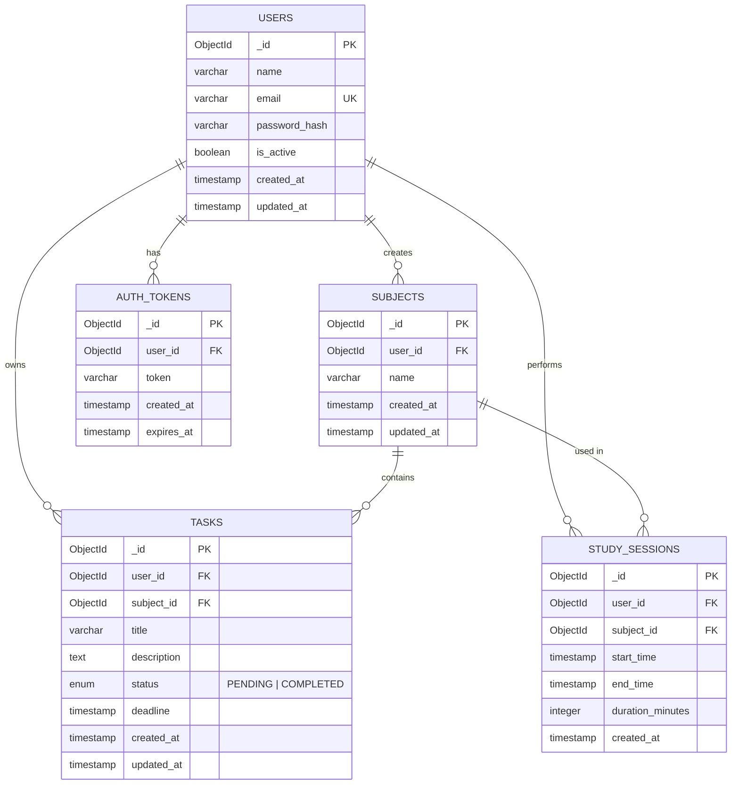

# ER Diagram — Study Planner System
## Overview

This Entity-Relationship diagram represents the database schema for the Study Planner System, a backend-focused application designed to help students manage their study subjects, tasks, and study sessions securely.

The schema models user authentication, subject organization, task management, and study session tracking, while enforcing data isolation, secure access using JWT, and structured backend architecture.

---

---

## Table Summary
| Table            | Description                                                 | Key Relationships                 |
| ---------------- | ----------------------------------------------------------- | --------------------------------- |
| `USERS`          | Stores all registered users and authentication information  | → Subjects, Tasks, Study Sessions |
| `SUBJECTS`       | Stores subjects created by users to organize study content  | ← User (many-to-one), → Tasks     |
| `TASKS`          | Stores study tasks associated with subjects and users       | ← User, ← Subject                 |
| `STUDY_SESSIONS` | Stores study session records including start and end time   | ← User, ← Subject                 |
| `AUTH_TOKENS`    | Stores JWT tokens for authentication and session management | ← User                            |

---
## Key Indexes
| Table            | Index                   | Purpose                                       |
| ---------------- | ----------------------- | --------------------------------------------- |
| `USERS`          | `(email)`               | Fast login and authentication lookup          |
| `SUBJECTS`       | `(user_id)`             | Fetch subjects belonging to a specific user   |
| `TASKS`          | `(user_id, subject_id)` | Efficient task retrieval per subject and user |
| `TASKS`          | `(status)`              | Filter completed and pending tasks            |
| `STUDY_SESSIONS` | `(user_id)`             | Fetch user study session history              |
| `STUDY_SESSIONS` | `(subject_id)`          | Fetch study sessions for a subject            |
| `AUTH_TOKENS`    | `(user_id)`             | Manage authentication tokens                  |
