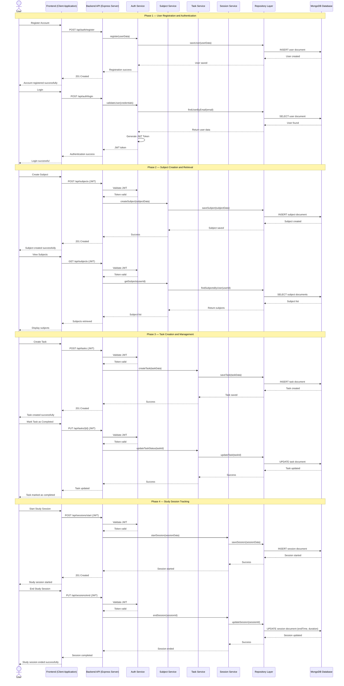

# Sequence Diagram — Study Planner System
## Main Flow: User Authentication → Subject Creation → Task Creation → Study Session Tracking
This sequence diagram illustrates the complete lifecycle of a user interacting with the Study Planner System — from user registration and authentication, to creating subjects and tasks, and finally starting and ending a study session while securely storing and retrieving data from the database.

---
## Flow Summary

| Phase                         | Description                                                                          | Key Patterns Used           |
| ----------------------------- | ------------------------------------------------------------------------------------ | --------------------------- |
| **1. Authentication**         | User registers and logs in with JWT authentication and secure password storage.      | Authentication Pattern, JWT |
| **2. Subject Management**     | User creates and views subjects with secure authorization.                           | Layered Architecture        |
| **3. Task Management**        | User creates, updates, and manages study tasks linked to subjects.                   | Service Layer Pattern       |
| **4. Study Session Tracking** | User starts and ends study sessions with duration tracking and database persistence. | Repository Pattern          |
| **5. Data Persistence**       | All user data is securely stored and retrieved from MongoDB.                         | Repository Pattern          |

