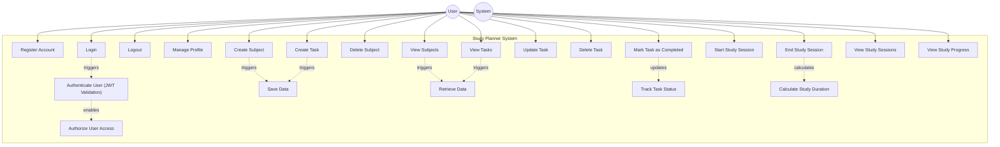

# Use Case Diagram — Study Planner System
## Overview
This diagram shows all major use cases for the Study Planner System, organized by the primary actor: User.
The system focuses on secure authentication, subject organization, task management, study session tracking, and progress monitoring, while ensuring data security, user isolation, and structured backend operations using JWT authentication.

---
## Use Case Descriptions 
| #    | Use Case                           | Actors | Description                                                          |
| ---- | ---------------------------------- | ------ | -------------------------------------------------------------------- |
| UC1  | Register Account                   | User   | Create a new account using name, email, and password.                |
| UC2  | Login                              | User   | Authenticate user and generate JWT token for secure access.          |
| UC3  | Logout                             | User   | Logout from the system and end the client session.                   |
| UC4  | Manage Profile                     | User   | View and manage personal profile information.                        |
| UC5  | Create Subject                     | User   | Create a subject to organize study tasks.                            |
| UC6  | View Subjects                      | User   | View all subjects created by the user.                               |
| UC7  | Delete Subject                     | User   | Remove a subject from the system.                                    |
| UC8  | Create Task                        | User   | Create a study task associated with a subject.                       |
| UC9  | View Tasks                         | User   | View all study tasks created by the user.                            |
| UC10 | Update Task                        | User   | Modify task information such as title, description, or deadline.     |
| UC11 | Delete Task                        | User   | Remove a study task from the system.                                 |
| UC12 | Mark Task as Completed             | User   | Update task status from pending to completed.                        |
| UC13 | Start Study Session                | User   | Start a study session for a selected subject.                        |
| UC14 | End Study Session                  | User   | End the study session and record session duration.                   |
| UC15 | View Study Sessions                | User   | View all study sessions performed by the user.                       |
| UC16 | View Study Progress                | User   | View study progress including completed tasks and sessions.          |
| UC17 | Authenticate User (JWT Validation) | System | Verify JWT token to ensure secure authentication.                    |
| UC18 | Authorize User Access              | System | Ensure user can only access their own subjects, tasks, and sessions. |
| UC19 | Save Data                          | System | Store subjects, tasks, and study sessions in MongoDB.                |
| UC20 | Retrieve Data                      | System | Fetch subjects, tasks, and sessions from MongoDB.                    |
| UC21 | Track Task Status                  | System | Maintain and update task completion status.                          |
| UC22 | Calculate Study Duration           | System | Calculate study session duration based on start and end time.        |
